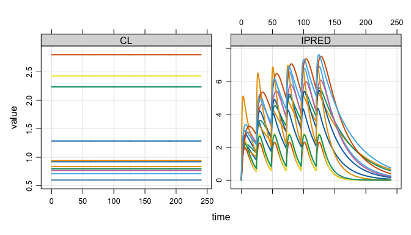

<!-- README.md is generated from README.Rmd. Please edit that file -->

# mrgsim.ds

<!-- badges: start -->

<!-- badges: end -->

`mrgsim.ds` provides an [Apache
Arrow](https://arrow.apache.org/docs/r/)-backed simulation output object
for [mrgsolve](https://mrgsolve.org), greatly reducing the memory
footprint of large simulations and providing a high-performance pipeline
for summarizing huge simulation outputs.

## Installation

You can install the development version of `mrgsim.ds` from
[GitHub](https://github.com/kylebaron/mrgsim.ds) with:

``` r
# install.packages("devtools")
devtools::install_github("kylebaron/mrgsim.ds")
```

## Example

We will illustrate `mrgsim.ds` by doing a simulation.

``` r
library(mrgsim.ds)
library(dplyr)

mod <- modlib_ds("popex", end = 240, outvars = "IPRED,CL")

data <- expand.ev(amt = 100, ii = 24, total = 6, ID = 1:3000)
```

`mrgsim.ds` provides a new `mrgsim()` variant - `mrgsim_ds()`. The name
implies we are tapping into Apache Arrow
[Dataset](https://arrow.apache.org/docs/r/reference/Dataset.html)
functionality.

``` r
out <- mrgsim_ds(mod, data)

out
. Model: popex
. Dim  : 1.4M 4
. Files: 1 [11.9 Mb]
. Owner: yes
.     ID time        CL    IPRED
. 1:   1  0.0 0.7760773 0.000000
. 2:   1  0.0 0.7760773 0.000000
. 3:   1  0.5 0.7760773 2.525668
. 4:   1  1.0 0.7760773 3.810707
. 5:   1  1.5 0.7760773 4.439745
. 6:   1  2.0 0.7760773 4.722406
. 7:   1  2.5 0.7760773 4.822661
. 8:   1  3.0 0.7760773 4.827336
```

## Very lightweight simulation output object

The output object doesn’t actually carry the simulated data, but rather
a pointer to the data in parquet files on your disk.

``` r
basename(out$files)
. [1] "mrgsims-ds-f23d5b23aa06.parquet"
```

This means there is almost nothing inside the object itself

``` r
lobstr:::obj_size(out)
. 292.53 kB

dim(out)
. [1] 1446000       4
```

What if we did the same simulation with regular `mrgsim()`?

``` r
x <- mrgsim(mod, data)

lobstr::obj_size(x)
. 46.30 MB

dim(x)
. [1] 1446000       4
```

The object is very light weight despite carrying the same data.

## Handles like regular mrgsim output

But, we can do a lot of the typical things we would with any `mrgsim()`
output object.

``` r
plot(out, nid = 12)
```



``` r
head(out)
. # A tibble: 6 × 4
.      ID  time    CL IPRED
.   <dbl> <dbl> <dbl> <dbl>
. 1     1   0   0.776  0   
. 2     1   0   0.776  0   
. 3     1   0.5 0.776  2.53
. 4     1   1   0.776  3.81
. 5     1   1.5 0.776  4.44
. 6     1   2   0.776  4.72

tail(out)
. # A tibble: 6 × 4
.      ID  time    CL IPRED
.   <dbl> <dbl> <dbl> <dbl>
. 1  3000  238. 0.327  1.09
. 2  3000  238  0.327  1.07
. 3  3000  238. 0.327  1.06
. 4  3000  239  0.327  1.05
. 5  3000  240. 0.327  1.04
. 6  3000  240  0.327  1.02

dim(out)
. [1] 1446000       4
```

This includes coercing to different types of objects. We can get the
usual R data frames

``` r
as_tibble(out)
. # A tibble: 1,446,000 × 4
.       ID  time    CL IPRED
.    <dbl> <dbl> <dbl> <dbl>
.  1     1   0   0.776  0   
.  2     1   0   0.776  0   
.  3     1   0.5 0.776  2.53
.  4     1   1   0.776  3.81
.  5     1   1.5 0.776  4.44
.  6     1   2   0.776  4.72
.  7     1   2.5 0.776  4.82
.  8     1   3   0.776  4.83
.  9     1   3.5 0.776  4.78
. 10     1   4   0.776  4.71
. # ℹ 1,445,990 more rows
```

Or stay in the arrow ecosystem

``` r
as_arrow_ds(out)
. FileSystemDataset with 1 Parquet file
. 4 columns
. ID: double
. time: double
. CL: double
. IPRED: double
. 
. See $metadata for additional Schema metadata
```

Or try your hand at duckdb

``` r
as_duckdb_ds(out)
. # Source:   table<arrow_001> [?? x 4]
. # Database: DuckDB 1.4.3 [kyleb@Darwin 24.6.0:R 4.5.2/:memory:]
.       ID  time    CL IPRED
.    <dbl> <dbl> <dbl> <dbl>
.  1     1   0   0.776  0   
.  2     1   0   0.776  0   
.  3     1   0.5 0.776  2.53
.  4     1   1   0.776  3.81
.  5     1   1.5 0.776  4.44
.  6     1   2   0.776  4.72
.  7     1   2.5 0.776  4.82
.  8     1   3   0.776  4.83
.  9     1   3.5 0.776  4.78
. 10     1   4   0.776  4.71
. # ℹ more rows
```

## Tidyverse-friendly

We’ve integrated into the `dplyr` ecosystem as well, allowing you to
`filter()`, `group_by()`, `mutate()`, or `select()` your way directly
into a pipeline to summarize your simulations using the power of Apache
Arrow.

``` r
dd <- 
  out %>% 
  group_by(time) %>% 
  summarise(Mean = mean(IPRED, na.rm = TRUE), n = n()) %>% 
  arrange(time)

dd
. FileSystemDataset (query)
. time: double
. Mean: double
. n: int64
. 
. * Sorted by time [asc]
. See $.data for the source Arrow object
```

``` r
collect(dd)
. # A tibble: 481 × 3
.     time  Mean     n
.    <dbl> <dbl> <int>
.  1   0    0     6000
.  2   0.5  1.08  3000
.  3   1    1.77  3000
.  4   1.5  2.22  3000
.  5   2    2.54  3000
.  6   2.5  2.76  3000
.  7   3    2.90  3000
.  8   3.5  3.00  3000
.  9   4    3.06  3000
. 10   4.5  3.10  3000
. # ℹ 471 more rows
```

## Good for large simulations

This workflow is particularly useful when running replicate simulations
in parallel, with large outputs

``` r
library(future.apply, quietly = TRUE)

plan(multisession, workers = 5L)

out2 <- future_lapply(1:10, \(x) { mrgsim_ds(mod, data) }, future.seed = TRUE)

out2 <- reduce_ds(out2)

out2
. Model: popex
. Dim  : 14.5M 4
. Files: 10 [119.1 Mb]
. Owner: yes
.     ID time       CL    IPRED
. 1:   1  0.0 2.269799 0.000000
. 2:   1  0.0 2.269799 0.000000
. 3:   1  0.5 2.269799 2.459481
. 4:   1  1.0 2.269799 3.975675
. 5:   1  1.5 2.269799 4.841514
. 6:   1  2.0 2.269799 5.263985
. 7:   1  2.5 2.269799 5.388896
. 8:   1  3.0 2.269799 5.318542
```

## Files on disk are automagically managed

All `arrow` files are stored in the `tempdir()` in parquet format

``` r
list_temp()
. 11 files [131.1 Mb]
. - mrgsims-ds-f23d5b23aa06.parquet
. - mrgsims-ds-f27d12dbb5b4.parquet
.    ...
. - mrgsims-ds-f2812e902211.parquet
. - mrgsims-ds-f28178aca1f8.parquet
```

This directory is eventually removed when the R session ends. Tools are
provided to manage the space.

``` r
retain_temp(out2)
. Discarding 1 files.

list_temp()
. 10 files [119.1 Mb]
. - mrgsims-ds-f27d12dbb5b4.parquet
. - mrgsims-ds-f27d16764618.parquet
.    ...
. - mrgsims-ds-f2812e902211.parquet
. - mrgsims-ds-f28178aca1f8.parquet
```

We also put a finalizer on each object so that, when it goes out of
scope, the files are automatically cleaned up.

``` r
purge_temp()
. Discarding 10 files.

plan(multisession, workers = 5L)

out1 <- mrgsim_ds(mod, data)
rename_ds(out1, "out1")

out2 <- future_lapply(1:10, \(x) { mrgsim_ds(mod, data) }, future.seed = TRUE)

out2 <- reduce_ds(out2)
rename_ds(out2, "out2")

out3 <- mrgsim_ds(mod, data) 
rename_ds(out3, "out3")
```

``` r
list_temp()
. 12 files [143 Mb]
. - mrgsims-ds-out1-0001.parquet
. - mrgsims-ds-out2-0001.parquet
.    ...
. - mrgsims-ds-out2-0010.parquet
. - mrgsims-ds-out3-0001.parquet

rm(out2)
```

As soon as the garbage collector is called, the leftover files are
cleaned up.

``` r
gc()
.            used  (Mb) gc trigger  (Mb) limit (Mb) max used  (Mb)
. Ncells  1951539 104.3    3642577 194.6         NA  3205343 171.2
. Vcells 15245597 116.4   29095814 222.0      16384 27048738 206.4

list_temp()
. 2 files [23.8 Mb]
. - mrgsims-ds-out1-0001.parquet
. - mrgsims-ds-out3-0001.parquet
```

### Ownership

This setup is only possible if one object owns the files on disk and
`mrgsim.ds` tracks this.

``` r
ownership()
. Objects: 4 | Files: 13 | Size: 23.8 Mb
```

If I make a copy of a simulation object, the old object no longer owns
the files.

``` r
out4 <- copy_ds(out1, own = TRUE)

check_ownership(out1)
. [1] FALSE
check_ownership(out4)
. [1] TRUE
```

## If this is so great, why not make it the default for mrgsolve?

There is a cost to all of this. For small to mid-size simulations, you
might see a small slowdown with `mrgsim_ds()`; it definitely won’t be
faster than `mrgsim()` … even with the super-quick arrow ecosystem. This
workflow is really for large simulation volumes where you are happy to
pay the cost of writing outputs to file and then streaming them back in
to summarize.
