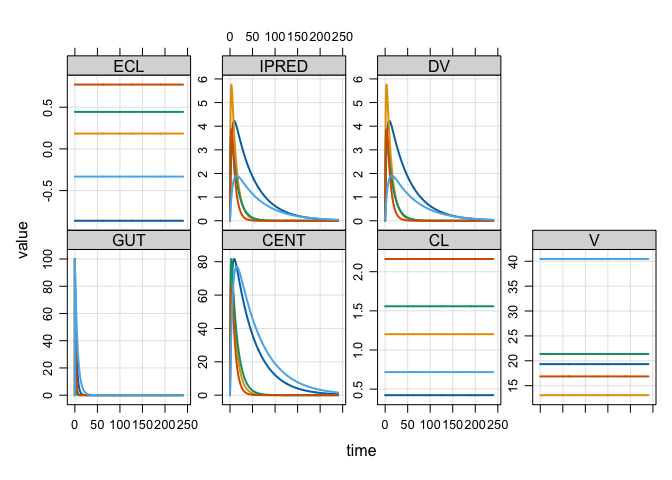

<!-- README.md is generated from README.Rmd. Please edit that file -->

# mrgsim.ds

<!-- badges: start -->

<!-- badges: end -->

About mrgsim.ds -

## Installation

You can install the development version of mrgsim.ds from
[GitHub](https://github.com/kylebaron/mrgsim.ds) with:

``` r
# install.packages("devtools")
devtools::install_github("kylebaron/mrgsim.ds")
```

## Example

We will illustrate mrgsim.ds by doing a simulation.

``` r
library(mrgsim.ds)

mod <- modlib_ds("popex", Req = "IPRED")

data <- expand.ev(amt = 100, ID = 1:1000)
```

mrgsim.ds provides a new `mrgsim()` variant - `mrgsim_ds()`:

``` r
out <- mrgsim_ds(mod, data)

out
. Model: popex
. Dim  : 482.0K 9
. Files: 1 [16 Mb]
.     ID time       GUT     CENT        CL        V      ECL    IPRED       DV
. 1:   1  0.0   0.00000  0.00000 0.4226588 19.32448 -0.86119 0.000000 0.000000
. 2:   1  0.0 100.00000  0.00000 0.4226588 19.32448 -0.86119 0.000000 0.000000
. 3:   1  0.5  85.78377 14.13680 0.4226588 19.32448 -0.86119 0.731549 0.731549
. 4:   1  1.0  73.58855 26.11013 0.4226588 19.32448 -0.86119 1.351143 1.351143
. 5:   1  1.5  63.12704 36.22922 0.4226588 19.32448 -0.86119 1.874784 1.874784
. 6:   1  2.0  54.15275 44.75933 0.4226588 19.32448 -0.86119 2.316198 2.316198
. 7:   1  2.5  46.45427 51.92798 0.4226588 19.32448 -0.86119 2.687161 2.687161
. 8:   1  3.0  39.85023 57.93035 0.4226588 19.32448 -0.86119 2.997770 2.997770
```

The output object doesn’t actually carry the simulated data, but rather
a pointer to the data in parquet files on your disk.

``` r
as_arrow_ds(out)
. FileSystemDataset with 1 Parquet file
. 9 columns
. ID: double
. time: double
. GUT: double
. CENT: double
. CL: double
. V: double
. ECL: double
. IPRED: double
. DV: double
. 
. See $metadata for additional Schema metadata
```

``` r
plot(out)
```


