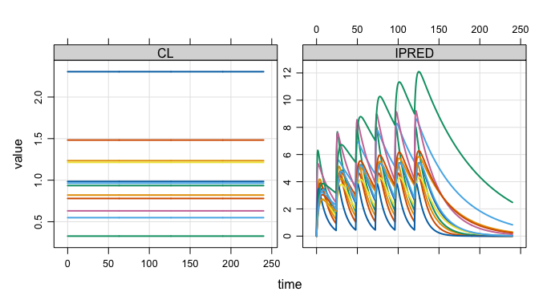

# mrgsim.ds

`mrgsim.ds` provides an [Apache
Arrow](https://arrow.apache.org/docs/r/)-backed simulation output object
for [mrgsolve](https://mrgsolve.org), greatly reducing the memory
footprint of large simulations and providing a high-performance pipeline
for summarizing huge simulation outputs. The arrow-based simulation
output objects in R claim ownership of their files on disk. Those files
are automatically removed when the owning object goes out of scope and
becomes subject to the R garbage collector. While “anonymous”,
parquet-formatted files hold the data in
[`tempdir()`](https://rdrr.io/r/base/tempfile.html) as you are working
in R, functions are provided to move this data to more permanent
locations for later use.

## Installation

You can install the development version of `mrgsim.ds` from
[r-universe](https://kylebaron.r-universe.dev/mrgsim.ds) with:

``` r
# Install 'mrgsim.ds' in R:
install.packages('mrgsim.ds', repos = c('https://kylebaron.r-universe.dev', 'https://cloud.r-project.org'))
```

## Example

We will illustrate `mrgsim.ds` by doing a simulation.

``` r
library(mrgsim.ds)
library(dplyr)

mod <- modlib_ds("popex", end = 240, outvars = "IPRED,CL")

data <- expand.ev(amt = 100, ii = 24, total = 6, ID = 1:3000)
```

`mrgsim.ds` provides a new
[`mrgsim()`](https://mrgsolve.org/docs/reference/mrgsim.html) variant -
[`mrgsim_ds()`](https://kylebaron.github.io/mrgsim.ds/reference/mrgsim_ds.md).
The name implies we are tapping into Apache Arrow
[Dataset](https://arrow.apache.org/docs/r/reference/Dataset.html)
functionality. The simulation below carries `1,446,000` rows.

``` r
out <- mrgsim_ds(mod, data)

out
. Model: popex
. Dim  : 1.4M x 4
. Files: 1 [11.9 Mb]
. Owner: yes
.     ID time        CL     IPRED
. 1:   1  0.0 0.9842626 0.0000000
. 2:   1  0.0 0.9842626 0.0000000
. 3:   1  0.5 0.9842626 0.6553811
. 4:   1  1.0 0.9842626 1.2101379
. 5:   1  1.5 0.9842626 1.6776054
. 6:   1  2.0 0.9842626 2.0693958
. 7:   1  2.5 0.9842626 2.3956201
. 8:   1  3.0 0.9842626 2.6650809
```

## Very lightweight simulation output object

The output object doesn’t actually carry these 1.4M rows of simulated
data. Rather it stores a pointer to the data in parquet files on your
disk.

``` r
basename(out$files)
. [1] "mrgsims-ds-6d29612b7df3.parquet"
```

This means there is almost nothing inside the object itself

``` r
lobstr:::obj_size(out)
. 292.51 kB

dim(out)
. [1] 1446000       4
```

What if we did the same simulation with regular
[`mrgsim()`](https://mrgsolve.org/docs/reference/mrgsim.html)?

``` r
x <- mrgsim(mod, data)

lobstr::obj_size(x)
. 46.30 MB

dim(x)
. [1] 1446000       4
```

The `mrgsim.ds` object is very light weight despite tracking the same
data.

## Handles like regular mrgsim output

But, we can do a lot of the typical things we would with any
[`mrgsim()`](https://mrgsolve.org/docs/reference/mrgsim.html) output
object.

``` r
plot(out, nid = 12)
```



``` r
head(out)
. # A tibble: 6 × 4
.      ID  time    CL IPRED
.   <dbl> <dbl> <dbl> <dbl>
. 1     1   0   0.984 0    
. 2     1   0   0.984 0    
. 3     1   0.5 0.984 0.655
. 4     1   1   0.984 1.21 
. 5     1   1.5 0.984 1.68 
. 6     1   2   0.984 2.07

tail(out)
. # A tibble: 6 × 4
.      ID  time    CL  IPRED
.   <dbl> <dbl> <dbl>  <dbl>
. 1  3000  238.  1.16 0.0130
. 2  3000  238   1.16 0.0126
. 3  3000  238.  1.16 0.0123
. 4  3000  239   1.16 0.0120
. 5  3000  240.  1.16 0.0116
. 6  3000  240   1.16 0.0113

dim(out)
. [1] 1446000       4
```

This includes coercing to different types of objects. We can get the
usual R data frames

``` r
as_tibble(out)
. # A tibble: 1,446,000 × 4
.       ID  time    CL IPRED
.    <dbl> <dbl> <dbl> <dbl>
.  1     1   0   0.984 0    
.  2     1   0   0.984 0    
.  3     1   0.5 0.984 0.655
.  4     1   1   0.984 1.21 
.  5     1   1.5 0.984 1.68 
.  6     1   2   0.984 2.07 
.  7     1   2.5 0.984 2.40 
.  8     1   3   0.984 2.67 
.  9     1   3.5 0.984 2.89 
. 10     1   4   0.984 3.06 
. # ℹ 1,445,990 more rows
```

Or stay in the arrow ecosystem

``` r
as_arrow_ds(out)
. FileSystemDataset with 1 Parquet file
. 4 columns
. ID: double
. time: double
. CL: double
. IPRED: double
. 
. See $metadata for additional Schema metadata
```

Or try your hand at duckdb

``` r
as_duckdb_ds(out)
. # Source:   table<arrow_001> [?? x 4]
. # Database: DuckDB 1.4.3 [kyleb@Darwin 24.6.0:R 4.5.2/:memory:]
.       ID  time    CL IPRED
.    <dbl> <dbl> <dbl> <dbl>
.  1     1   0   0.984 0    
.  2     1   0   0.984 0    
.  3     1   0.5 0.984 0.655
.  4     1   1   0.984 1.21 
.  5     1   1.5 0.984 1.68 
.  6     1   2   0.984 2.07 
.  7     1   2.5 0.984 2.40 
.  8     1   3   0.984 2.67 
.  9     1   3.5 0.984 2.89 
. 10     1   4   0.984 3.06 
. # ℹ more rows
```

## Tidyverse-friendly

We’ve integrated into the `dplyr` ecosystem as well, allowing you to
[`filter()`](https://dplyr.tidyverse.org/reference/filter.html),
[`group_by()`](https://dplyr.tidyverse.org/reference/group_by.html),
[`mutate()`](https://dplyr.tidyverse.org/reference/mutate.html),
[`select()`](https://dplyr.tidyverse.org/reference/select.html),
[`summarise()`](https://dplyr.tidyverse.org/reference/summarise.html),
[`rename()`](https://dplyr.tidyverse.org/reference/rename.html), or
[`arrange()`](https://dplyr.tidyverse.org/reference/arrange.html) your
way directly into a pipeline to summarize your simulations using the
power of Apache Arrow.

``` r
dd <- 
  out %>% 
  group_by(time) %>% 
  summarise(Mean = mean(IPRED, na.rm = TRUE), n = n()) %>% 
  arrange(time)

dd
. FileSystemDataset (query)
. time: double
. Mean: double
. n: int64
. 
. * Sorted by time [asc]
. See $.data for the source Arrow object
```

``` r
collect(dd)
. # A tibble: 481 × 3
.     time  Mean     n
.    <dbl> <dbl> <int>
.  1   0    0     6000
.  2   0.5  1.11  3000
.  3   1    1.81  3000
.  4   1.5  2.27  3000
.  5   2    2.58  3000
.  6   2.5  2.79  3000
.  7   3    2.94  3000
.  8   3.5  3.03  3000
.  9   4    3.09  3000
. 10   4.5  3.13  3000
. # ℹ 471 more rows
```

## Good for large simulations

This workflow is particularly useful when running replicate simulations
in parallel, with large outputs

``` r
library(future.apply, quietly = TRUE)

plan(multisession, workers = 5L)

out2 <- future_lapply(1:10, \(x) { mrgsim_ds(mod, data) }, future.seed = TRUE)

out2 <- reduce_ds(out2)
```

Now there are 10x the number of rows, but little change in object size.

``` r
out2
. Model: popex
. Dim  : 14.5M x 4
. Files: 10 [119.1 Mb]
. Owner: yes
.     ID time        CL    IPRED
. 1:   1  0.0 0.4933386 0.000000
. 2:   1  0.0 0.4933386 0.000000
. 3:   1  0.5 0.4933386 1.114750
. 4:   1  1.0 0.4933386 1.969898
. 5:   1  1.5 0.4933386 2.622833
. 6:   1  2.0 0.4933386 3.118296
. 7:   1  2.5 0.4933386 3.491162
. 8:   1  3.0 0.4933386 3.768619
```

``` r
lobstr::obj_size(out2)
. 295.56 kB
```

## Files on disk are automagically managed

All `arrow` files are stored in the
[`tempdir()`](https://rdrr.io/r/base/tempfile.html) in parquet format

``` r
list_temp()
. 11 files [131.1 Mb]
. - mrgsims-ds-6d29612b7df3.parquet
. - mrgsims-ds-6d676470501e.parquet
.    ...
. - mrgsims-ds-6d6b1af63d2.parquet
. - mrgsims-ds-6d6b21c270db.parquet
```

This directory is eventually removed when the R session ends. Tools are
provided to manage the space.

``` r
retain_temp(out2)
. Discarding 1 files.

list_temp()
. 10 files [119.1 Mb]
. - mrgsims-ds-6d676470501e.parquet
. - mrgsims-ds-6d6799c1516.parquet
.    ...
. - mrgsims-ds-6d6b1af63d2.parquet
. - mrgsims-ds-6d6b21c270db.parquet
```

We also put a finalizer on each object so that, when it goes out of
scope, the files are automatically cleaned up.

First, run a bunch of simulations.

``` r
plan(multisession, workers = 5L)

out1 <- mrgsim_ds(mod, data)
rename_ds(out1, "out1")

out2 <- future_lapply(1:10, \(x) { mrgsim_ds(mod, data) }, future.seed = TRUE)

out2 <- reduce_ds(out2)
rename_ds(out2, "out2")

out3 <- mrgsim_ds(mod, data) 
rename_ds(out3, "out3")
```

There are 12 files holding simulation outputs.

``` r
list_temp()
. 12 files [143 Mb]
. - mrgsims-ds-out1-0001.parquet
. - mrgsims-ds-out2-0001.parquet
.    ...
. - mrgsims-ds-out2-0010.parquet
. - mrgsims-ds-out3-0001.parquet
```

Now, remove one of the objects containing 10 files.

``` r
rm(out2)
```

As soon as the garbage collector is called, the leftover files are
cleaned up.

``` r
gc()
.            used  (Mb) gc trigger  (Mb) limit (Mb) max used  (Mb)
. Ncells  1946963 104.0    3643548 194.6         NA  3289688 175.7
. Vcells 15237378 116.3   29085772 222.0      16384 27013637 206.1

list_temp()
. 2 files [23.8 Mb]
. - mrgsims-ds-out1-0001.parquet
. - mrgsims-ds-out3-0001.parquet
```

### Ownership

This setup is only possible if one object owns the files on disk and
`mrgsim.ds` tracks this.

``` r
ownership()
. > Objects: 4 | Files: 13 | Size: 23.8 Mb
```

If I make a copy of a simulation object, the old object no longer owns
the files.

``` r
out4 <- copy_ds(out1, own = TRUE)

check_ownership(out1)
. [1] FALSE

check_ownership(out4)
. [1] TRUE
```

I can always take ownership back.

``` r
take_ownership(out1)

check_ownership(out1)
. [1] TRUE

check_ownership(out4)
. [1] FALSE
```

## If this is so great, why not make it the default for mrgsolve?

There is a cost to all of this. For small to mid-size simulations, you
might see a small slowdown with
[`mrgsim_ds()`](https://kylebaron.github.io/mrgsim.ds/reference/mrgsim_ds.md);
it definitely won’t be faster than
[`mrgsim()`](https://mrgsolve.org/docs/reference/mrgsim.html) … even
with the super-quick arrow ecosystem. This workflow is really for large
simulation volumes where you are happy to pay the cost of writing
outputs to file and then streaming them back in to summarize.
